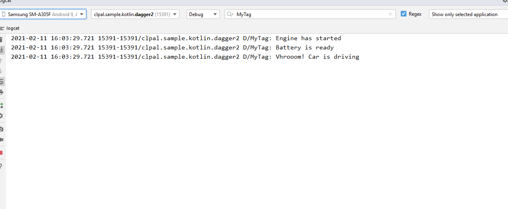

Constructor Injection. 
#1 Dependenices can be represented by a graph called "Dependency Graph"
#2 if Dependency Graph contain no cycles it called Directed Accyclic Graph ,in short "DAG"
#3 That's where the name "DAGger" came from   
 # End Point String Depends-->ConnectionImpl Depends-->NetworkClient Depends-->MainPresenter Depends-->MainActivity
 # End Point String <-- Returns ConnectionImpl <-- Returns NetworkClient<-- Returns MainPresenter <-- Returns MainActivity
 # End Point String (@Inject)-->ConnectionImpl(@Inject)-->NetworkClient(@Inject)-->MainPresenter (@Inject)-->(@Component)MainActivity
# MainPresenter is Top level Factory is used @Component
# for Dependency we used @Inject
    
  />
